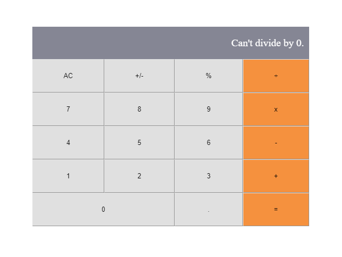

# js-capstone

In this project we will prepare a Kanban board with a GitHub project, with my Learning partner. 
It's javascript capstone project with external API.


# We used:
- Html & CSS
- Webpacks
- Linters
- Jest
- & Javascript



 
## Built With the following

- HTML
- CSS
- HTML&CSS Linter
- Webpack

## Get Started

Please get your browser update.
To get a local copy up and running follow these simple steps.

Run the command below from the Terminal:

      git clone <URL> 'https://github.com/mwanawabangona/js-capstone/tree/dev' in your terminal

	 
  ```cd events```

> install project dependencies

  ```npm install```

> build project

  ```npm run build```

> start project

  ```npm start```


## Authors

👤 **Ellis**

- Location: Zambia
- GitHub: [@mwnanawabangona](https://github.com/mwanawabangona)
- Twitter: [@Ellis_aah](https://twitter.com/Ellis-aah)
- LinkedIn: [LinkedIn](https://www.linkedin.com/)
## 🤝 Contributing

Contributions, issues, and feature requests are welcome!

Feel free to check the [issues page](https://github.com/mwanawabangona/js-capstone/issues).

## Show your support

Give a ⭐️ if you like this project!

## Acknowledgments

- Thanks to Microverse and my Coding Partners

## 📝 License

This project is [MIT](./MIT.md) licensed.

